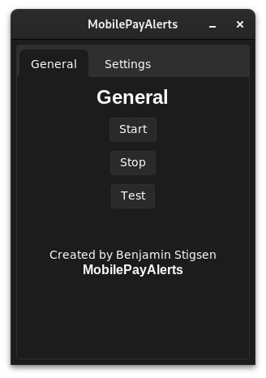
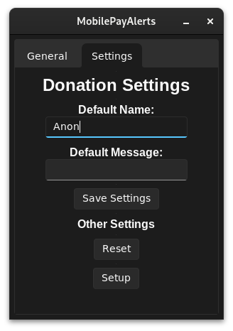

# MobilePayAlerts
Python application to show MobilePay donations on stream, using Streamlabs and Pushbullet.

Code review: https://youtu.be/xgDHSmae2Ks

## Installation
MobilePayAlerts can be installed from itch.io here:  
https://benstigsen.itch.io/mobilepayalerts

Follow the instructions in this YouTube video:  
https://www.youtube.com/watch?v=mg-P0hnSPsg

## Development
- Download/clone the repository.
- Install dependencies `pip install -r requirements.txt`
- Run the application `python main.py`

## Screenshots

